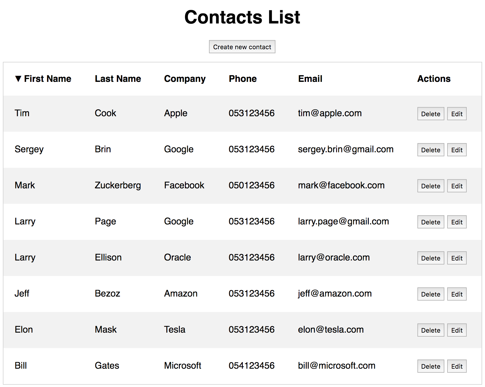

# NgCRUD

CRUD application created using Angular 2.

# Backend

I developed a backend using nodeJS/expressJS and MongoDB for this app:
[https://github.com/leon-good-life/smallProjects/tree/master/contacts-backend](https://github.com/leon-good-life/smallProjects/tree/master/contacts-backend)

# screenshots:

## Development server
Run `ng serve` for a dev server. Navigate to `http://localhost:4200/`. The app will automatically reload if you change any of the source files.